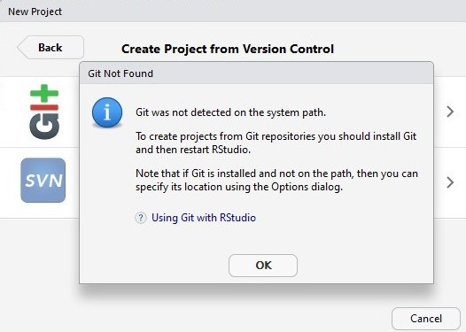

Version control with GitHub for Rstudio

### 1.0 Contents

- [1.1 Inspiration](https://github.com/jungxue/R-lyublyu-Git/blob/master/README.md#11-inspiration)
- [1.2 Basic setups](https://github.com/jungxue/R2Git/blob/master/README.md#12-basic-setups)
- [1.3 Instructions](https://github.com/jungxue/R2Git#13-instructions)
- 
- 
- [Reference]()

-------------------------------------------------------------------------------------------------------------------

### 1.1 Inspiration

I am at a stage of my study where needs for programming is becoming essential, and I start to come across this thing called Github. At first I thought it was like a forum or community where programmers hangout, and spin yarns, but one day I received an seminar notification email from Medhi about [Blakes's Github seminar](https://github.com/sccuoa/intro-to-git) and thought yeah I kept came across this github thing might as well see what is it about. And then I learnt about version control, I wish I knew about and start using github earlier.

What are benefits of incorporating Github with my R projects:

1. Version Control, keep track on your projects and makes it easier to collaborate. Obviously. 
2. Able to browse and download other peoples shared codes, this is what I do for fun now.
3. Create a public profile for myself, my github is the first thing that came up in google search if I search my name.
4. An alternative platform which I can do blog/notes, at Uni and at home. It is better than good old microsoft word. 
5. I can quickly present my projects or codes to other people by sending them a github repository link.
6. I Need to use github if I was to create my personal website using R Blogdown.

Some cons

1. I use github to procastinate, this wastes a lot of time
2. I started compare myself to other people on Github. And this usually end up in me realising how much I really suck at coding, losing self esteem and contemplating about my life. 
3. There are no spell checks, now people will see how bad my spelling really is. Maybe I need to do my markdown files on an editor rather than do it on github. 
4.I am still unfamilar with github and I do things ineffeciently, if you see me doing like 100 commits in a day, that does not meant I did a lot of work on that day, it probably meant that I was confused as and had to keep doing commints to fix things up.  

-------------------------------------------------------------------------------------------------------------------

### 1.2 Basic setups

First, you need to have R (preferably also the latest version of R-Studio) and a Github account in order to start, and also Git bash for the commands. Here are links for you to start your download. 

- [**R**](https://cran.r-project.org/)
- [**R-Studio**](https://www.rstudio.com/products/rstudio/download/)
- [**Github**](https://github.com/)
- [**Gtitbash**](https://gitforwindows.org/) or [automatic download](https://git-scm.com/download/win)

-------------------------------------------------------------------------------------------------------------------

### 1.3 Instructions

- [**Step 1**]  Check if you already have git installed In RStudio:

File → New Project → Version Control → Git

If you dont have git or was not setup properly (I can do it on University PC) you will see this

Otherwise you will see this, which allows you to clone a repository onto your laptop.

-------------------------------------------------------------------------------------------------------------------

### Reference

- **Ewen Harrison** R-blogger [RStudio and GitHub](https://www.r-bloggers.com/rstudio-and-github/)
- **Blake Seer** UoA SCC [intro to git (for R users)](https://github.com/sccuoa/intro-to-git)
- **Nathan Stephens** Rstudo support [Version Control with Git and SVN](https://support.rstudio.com/hc/en-us/articles/200532077-Version-Control-with-Git-and-SVN)
- **Hadley Wickham** [webinar](https://www.rstudio.com/resources/webinars/collaboration-and-time-travel-version-control-with-git-github-and-rstudio/)

